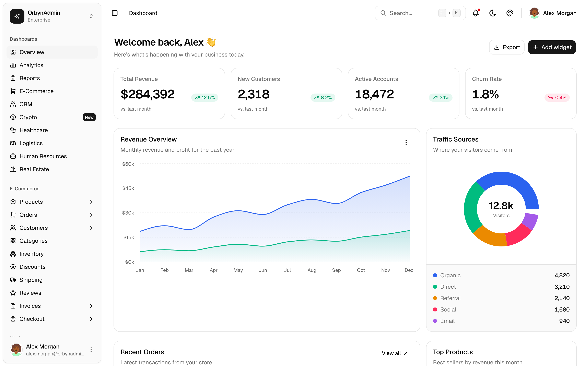
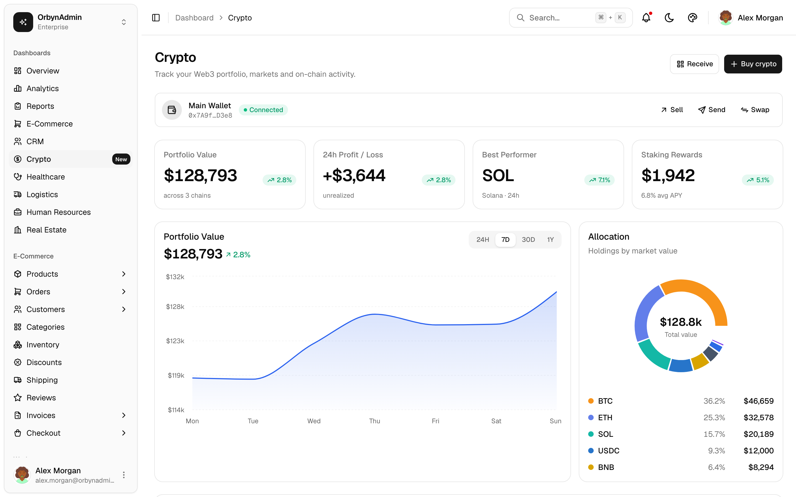
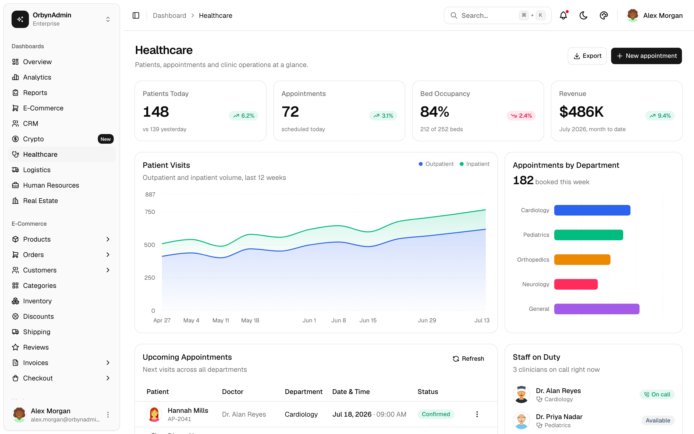
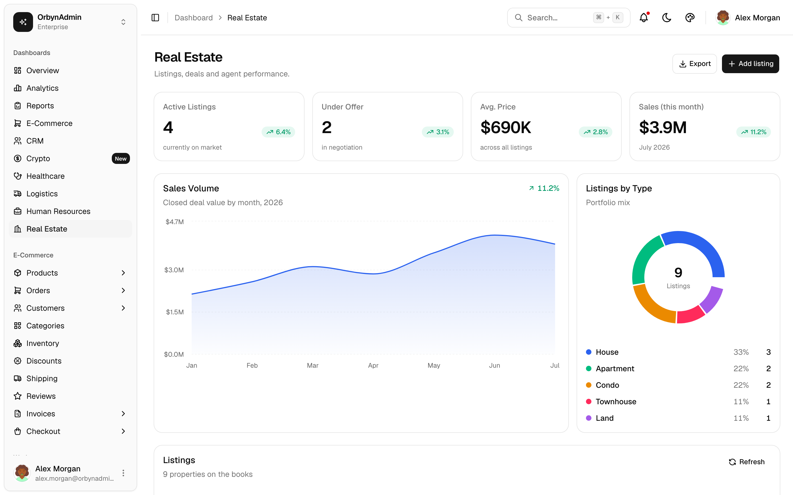
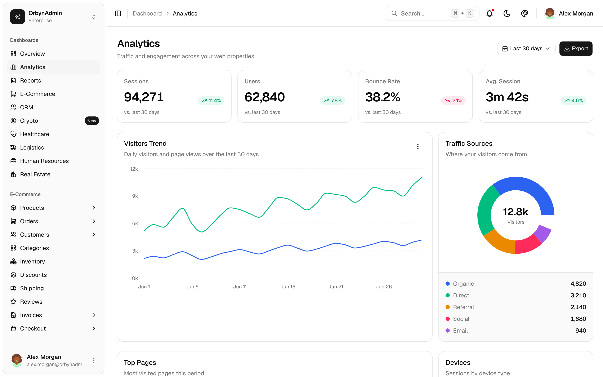
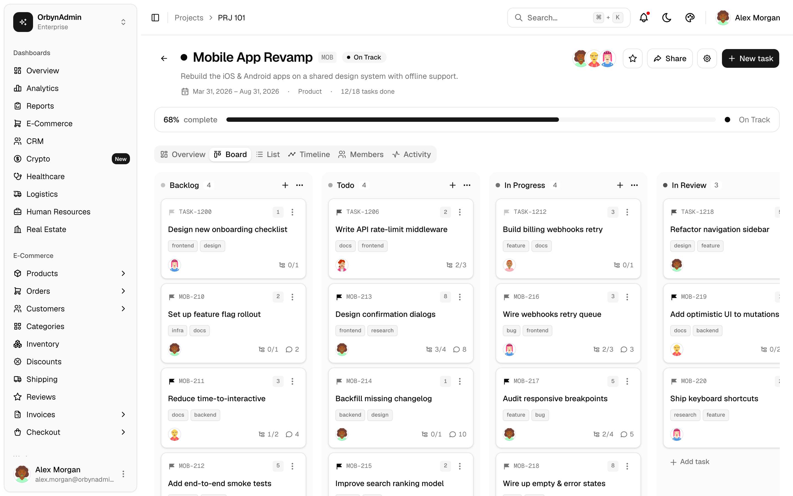
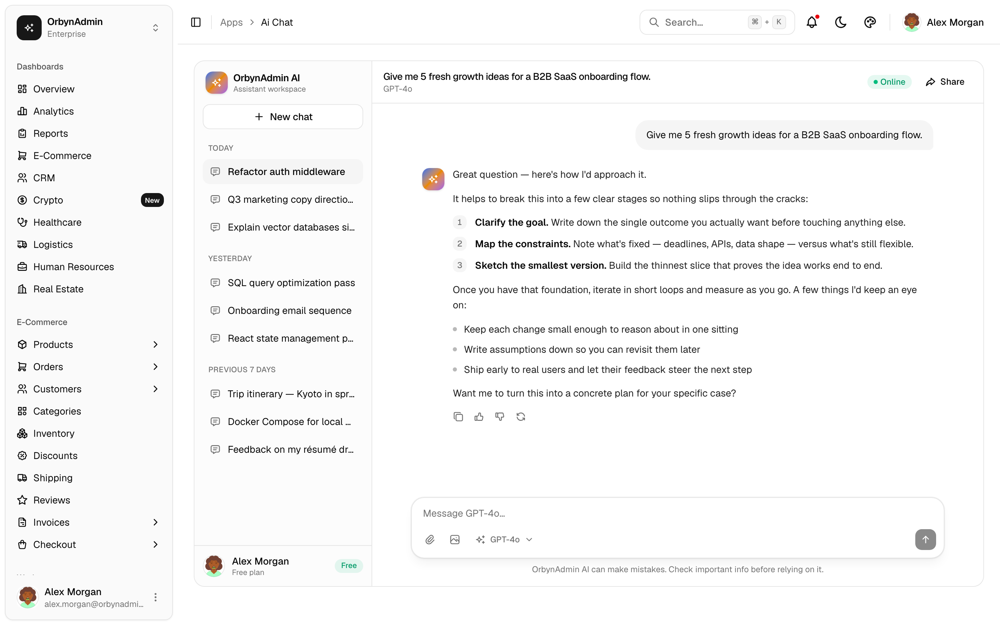
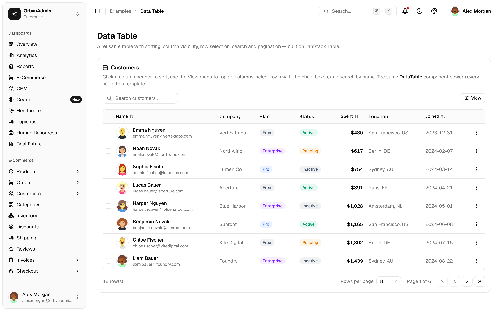
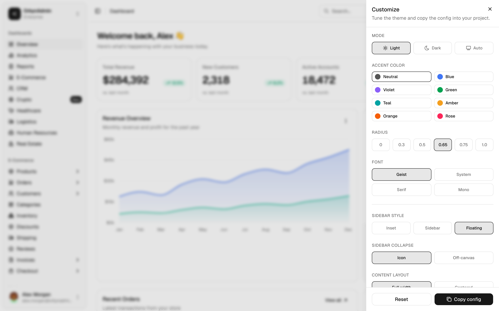
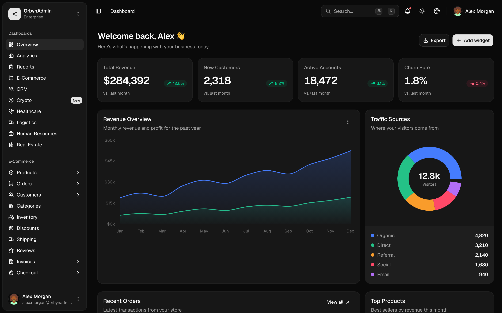

<div align="center">

# OrbynAdmin

A free and open-source admin dashboard template built with Next.js, Tailwind CSS and shadcn/ui. It ships with 70+ prebuilt pages (ten dashboards spanning e-commerce, CRM, crypto and four industries, plus a project management app, chat, mail, auth flows and more), all wired up with demo data so you can clone it and start building instead of setting up tables, charts and forms from scratch.

Everything is MIT licensed. No pro tier, no locked components.


**[Live demo](https://orbynadmin.vercel.app)** · [Getting started](#getting-started) · [What's included](#whats-included)



</div>

## Features

- 70+ pages and views: ten dashboards (Overview, Analytics, E-Commerce, CRM, Crypto, Healthcare, Logistics, HR, Real Estate, Reports), e-commerce management, project management and apps
- Light and dark mode
- A theme customizer to change the accent color, radius, font and sidebar layout, then copy the CSS variables into your own project
- Responsive down to mobile
- Command palette (⌘K), collapsible sidebar with nested menus, workspace switcher and account menu
- Charts with [Recharts](https://recharts.org) and a reusable data table built on [TanStack Table](https://tanstack.com/table)
- Auth pages: login, register, forgot / reset password, OTP and lock screen
- Written in TypeScript, statically pre-rendered

## Screenshots

**Crypto / Web3 dashboard.** Portfolio value over time, allocation, a markets watchlist with sparklines, on-chain transactions and working buy / sell / send / swap / receive flows.



**Industry dashboards.** Ready-made starting points for Healthcare, Logistics, Human Resources and Real Estate, each with its own charts, tables and dialogs.





**Analytics dashboard**



**Project management workspace.** Each project has an overview, a Kanban board, a list, a Gantt timeline, members and an activity feed.



**AI assistant**



**Reusable data table.** Sorting, column visibility, selection, search and pagination.



**Theme customizer and dark mode**





## Getting started

```bash
git clone https://github.com/masondevx/orbynadmin.git
cd orbynadmin
npm install
npm run dev
```

Open [http://localhost:3000](http://localhost:3000). Requires Node.js 20+.

```bash
npm run build   # production build
npm run start   # run the build
```

## Tech stack

- [Next.js 16](https://nextjs.org) (App Router, Turbopack)
- TypeScript
- [Tailwind CSS v4](https://tailwindcss.com)
- [shadcn/ui](https://ui.shadcn.com) + [Radix UI](https://www.radix-ui.com)
- [Recharts](https://recharts.org) for charts
- [TanStack Table](https://tanstack.com/table) for data tables
- [Tabler Icons](https://tabler.io/icons)
- [next-themes](https://github.com/pacocoursey/next-themes) for dark mode
- [DiceBear](https://www.dicebear.com) for the demo avatars

## What's included

- **Dashboards:** Overview, Analytics, Reports, E-Commerce, CRM, Crypto (Web3 portfolio), plus industry starters for Healthcare, Logistics, Human Resources and Real Estate
- **E-Commerce:** Products (data table + storefront grid), Orders, Customers, Invoices, Categories, Inventory, Discounts, Shipping, Reviews, Cart, Checkout (with list / detail / create / edit where it makes sense)
- **Project management:** Projects, a per-project workspace (Overview / Board / List / Timeline / Members / Activity), Team, Roles & Permissions, Contacts, Activity log
- **Apps:** AI Assistant, Chat, Mail, Calendar, Kanban, Tasks, Notes, File Manager, Support, Blog
- **Pages:** Profile, Settings, Developers (API keys & webhooks), Pricing, Integrations, Notifications, Help Center, Search
- **Auth:** Login, Register, Forgot / Reset password, OTP, Lock screen
- **Utility:** 404 / 403 / 500 / 503, Maintenance, Coming soon, Landing page, Onboarding
- **Examples:** Data table, Charts, Form layouts, UI elements, Empty states

## Project structure

```
src/
  app/
    (app)/          # authenticated pages (sidebar + header)
    (auth)/         # login, register, password reset, otp, lock
    landing/  onboarding/  maintenance/  coming-soon/
  components/       # sidebar, header, data-table, charts, theme-customizer, ui/
  config/nav.ts     # sidebar navigation
  data/index.ts     # demo data
```

All data is mock data. Replace `src/data/index.ts` (and the inline datasets on a few pages) with your own API.

## Deploy

[](https://vercel.com/new/clone?repository-url=https://github.com/masondevx/orbynadmin)

## Credits

Cryptocurrency icons are the respective projects' own brand marks (trademarks of their owners), drawn as inline SVGs in the flat style popularized by [theSVG](https://thesvg.org) and the [cryptocurrency-icons](https://github.com/spothq/cryptocurrency-icons) set. Demo avatars are generated with [DiceBear](https://www.dicebear.com). All names, balances, prices and figures throughout the template are fictional and for demonstration only.

## License

[MIT](LICENSE)
